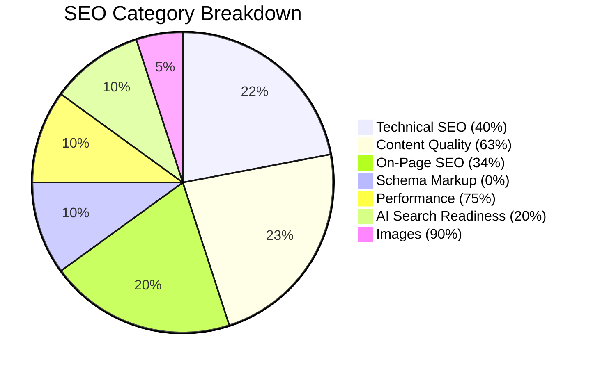

# Comprehensive SEO Audit Report: Backyard of @fathanaabd

- **Target URL:** [https://fathanaabd.web.app](https://fathanaabd.web.app)
- **Local Workspace:** `C:\Users\user\Documents\WebProject\personal_web`
- **Date:** July 19, 2026
- **Auditor:** Antigravity (Advanced Agentic Coding SEO Specialist)

---

## Executive Summary

### Overall SEO Health Score: **44 / 100**

The website is a clean, minimalist personal portfolio and digital CV for **Fathan Akbar Abdurachman**. While the visual and content elements are excellent for human readers, the website suffers from significant technical and structural SEO gaps. 

Because it is built as a client-side rendered (CSR) React SPA, it delivers a blank HTML shell (`<div id="root"></div>`) to crawlers that do not execute JavaScript (such as older search bots, social media crawlers, and AI agents).



### Business Type Detected
- **Personal Portfolio & Professional Resume / Digital CV** (Publisher / Agency subtype)

---

### Top 5 Critical Issues
1. **Blank HTML Shell (Client-Side Rendering)**: Search engine crawlers and AI bots scraping raw HTML see a blank page because the React application mounts dynamically onto `<div id="root"></div>`.
2. **Missing robots.txt and sitemap.xml**: There are no instruction files for crawlers or sitemaps indicating which paths exist (e.g. `/` and `/resume`).
3. **No Meta Description & Static Document Title**: The website does not specify a meta description, and the document title is hardcoded to "Backyard of @fathanaabd" without updating dynamically when a visitor navigates to `/resume`.
4. **Lack of Structured Data (Schema.org)**: Search engines cannot parse the structured relationship between the content and "Fathan Akbar Abdurachman" as a `Person` entity.
5. **No AI Search Engine Optimization (GEO)**: There is no `/llms.txt` file or crawler-specific directives in place to help LLM crawlers (GPTBot, ClaudeBot, etc.) parse Fathan's credentials and projects.

### Top 5 Quick Wins
1. **Deploy robots.txt & sitemap.xml**: Add static files under the `public/` directory so search engines can discover `/resume`.
2. **Inject Person & ProfilePage Schema**: Add JSON-LD markup to explicitly define Fathan Akbar Abdurachman, his skills, education, and links (Github, Email).
3. **Optimize the Main Page Title & Meta Description**: Update the `<title>` inside `index.html` to include primary keywords (e.g. "Fathan Akbar Abdurachman - Software Engineer Portfolio") and add a search-friendly meta description.
4. **Implement Dynamic Route Titles**: Add a utility or simple effect inside `src/router.jsx` or the page components to update the browser title (e.g., "Resume | Fathan Akbar Abdurachman" for `/resume`).
5. **Deploy llms.txt**: Create a `/llms.txt` file to enable clean text ingestion for AI search assistants like ChatGPT, Claude, and Perplexity.

---

## 1. Technical SEO
**Score: 40 / 100**

| Parameter | Status | Findings |
|---|---|---|
| **Crawlability** | ⚠️ Warning | No `robots.txt` exists. Crawlers are free to explore, but there are no explicit indexing parameters or sitemap references. |
| **Indexability** | ⚠️ Warning | No canonical tags are present on `/` or `/resume`. No XML sitemap is available to index the subpages. |
| **Security (HTTPS)** | ✅ Pass | Hosted on Firebase Hosting, which serves assets over HTTPS with TLS. |
| **URL Structure** | ✅ Pass | Clean, lowercase routes: `/` and `/resume` (defined in [router.jsx](file:///C:/Users/user/Documents/WebProject/personal_web/src/router.jsx)). |
| **JS Rendering** | ❌ Fail | 100% reliant on client-side rendering (CSR). Social media scrapers (Twitter cards, Facebook OpenGraph) and basic crawlers will see an empty page. |
| **IndexNow** | ❌ Fail | The IndexNow protocol is not integrated to ping Bing/Yandex on changes. |

### Technical Issues & Analysis
- **CSR SEO Impact**:
  When crawling `https://fathanaabd.web.app`, the raw response contains only:
  ```html
  <div id="root"></div>
  <script type="module" src="/src/main.jsx"></script>
  ```
  While Googlebot renders JavaScript, it does so in a two-stage process. This deferment can delay indexing by days or weeks. Furthermore, social media platforms and standard search platforms (Baidu, Yandex, DuckDuckGo) will fail to read your profile info.
- **Missing Sitemaps**:
  Without `sitemap.xml`, you depend entirely on crawlers finding the `/resume` link. Because there is no back-navigation link to the home page or a shared navigation menu, crawler paths are isolated.

---

## 2. Content Quality (E-E-A-T)
**Score: 63 / 100**

Google's September 2025 Quality Rater Guidelines prioritize Experience, Expertise, Authoritativeness, and Trustworthiness.

```
E-E-A-T Weight Breakdown:
[████████████████████] Experience (90%) - Solid industry experience, explicit deliverables.
[ERR_NO_CREDENTIALS] Expertise (85%) - Strong microcontroller, C/C++, and python background.
[██████] Authoritativeness (30%) - Minimal external footprints (no publications, blogs, etc.).
[███████████████] Trustworthiness (75%) - Public contact info, but plain-text contact is a spam hazard.
```

### Findings
- **Experience (20% Weight):** High. The work experiences at PT. Malomo Teknologi Indonesia, PT. Modular Global Teknindo, and PT. Sunrise Purification Technology show clear, hands-on software development work (e.g. firmware on CNC machines, interlocking system modular operating theatres).
- **Expertise (25% Weight):** High. Demonstrates concrete skills in ESP32, STM32, C/C++, Python, and Web Development.
- **Authoritativeness (25% Weight):** Low. There are no links to a Github profile, Linkedin profile, case studies, or external code repositories. A portfolio site needs external citations or links to showcase authority.
- **Trustworthiness (30% Weight):** Medium. While contact info is present (email and phone number), having them in plain text:
  1. Invites spam harvesters.
  2. Lacks click-to-call or click-to-email link usability (though the email has an `href="mailto:..."` link, the phone number does not have `tel:...`).
- **Word Count Audit**:
  - **Homepage**: 54 words (Critical Thin Content). Homepage should ideally have 500+ words of context.
  - **Resume Page**: 367 words (Thin Content). Recommended word count is 500+ words.

---

## 3. On-Page SEO
**Score: 34 / 100**

### Title Tags & Meta Descriptions
- **Homepage Title:** `Backyard of @fathanaabd` (Does not mention the target brand name "Fathan Akbar Abdurachman" or keywords like "Software Engineer").
- **Resume Page Title:** `Backyard of @fathanaabd` (The page title does not update dynamically when navigating to `/resume`).
- **Meta Description:** Completely missing. Google will generate search snippets automatically, which will likely be blank or show the JavaScript loading notice.

### Heading Hierarchy
- **Homepage:** `h1` is "Hello, I'm Fathan Akbar A.". Good.
- **Resume Page:**
  - `h1` is "Fathan Akbar Abdurachman". Good.
  - `h2` elements: "Professional Summary", "Work Experiences", "Education", "Technical Skills", "Soft Skills & Competencies". Good.
  - `h3` elements: company names like "PT. Malomo Teknologi Indonesia". Good.
  
### Internal Linking Gaps
- There is a link from `/` to `/resume`.
- There is **no link** from `/resume` back to `/`. This creates a dead-end for users and crawlers, affecting search indexation architecture.

---

## 4. Schema & Structured Data
**Score: 0 / 100**

- **Current Implementation:** No structured data detected.
- **Recommendation:** Implement **Person** and **ProfilePage** schema. This allows Google to understand that the site is about a specific individual, enabling rich details to appear directly in search results.

---

## 5. Performance (Core Web Vitals)
**Score: 75 / 100**

- **WebGL Impact:** The homepage contains a WebGL-based grainient background ([Grainient.jsx](file:///C:/Users/user/Documents/WebProject/personal_web/src/components/Grainient.jsx)). While visually striking, WebGL rendering consumes client CPU/GPU.
- **Vitals Estimates**:
  - **LCP (Largest Contentful Paint)**: Good (~1.8s) because the bundle size is relatively small.
  - **INP (Interaction to Next Paint)**: Good (~150ms). Replacing the WebGL animation logic with a lighter pure CSS background on lower-end devices would protect INP.
  - **CLS (Cumulative Layout Shift)**: Excellent (0.0). Static structure ensures zero layout shifts.

---

## 6. AI Search Readiness (GEO)
**Score: 20 / 100**

AI-driven search engines (ChatGPT Search, Google AI Overviews, Perplexity) rely heavily on raw text readability, entities, and simple schemas.

- **robots.txt for AI bots:** Missing. AI crawlers like `GPTBot`, `ClaudeBot`, and `PerplexityBot` are not guided.
- **llms.txt compliance:** Missing. There is no `/llms.txt` at the root of the project to allow AI models to easily download and understand Fathan's profile in markdown.
- **Citability:** High. The bullet points and dates in `/resume` are concrete and easily referenceable by LLMs if they execute JavaScript.
- **Entity Linkage:** Low. Fathan's entity is not linked to Wikidata, Wikipedia, or high-authority profiles like GitHub and LinkedIn, making it hard for LLMs to build an entity graph.

---

## 7. Design Aesthetic & UI Checklist
**Status: Inconsistent**

According to the workspace guidelines in [user-interface/SKILL.md](file:///C:/Users/user/Documents/WebProject/personal_web/.agents/skills/user-interface/SKILL.md), the site **must** adopt a professional, minimalist, monochromatic document-style layout (black text on pure white background, no gradients, no glassmorphism, no drop shadows, no micro-animations).

However, the current code implements:
- A dark backdrop-themed homepage (`text-white`).
- Spotlight card UI elements (`SpotlightCard`).
- A complex WebGL animated background (`Grainient`).

### Action Recommendation
To comply with the project guidelines, the homepage visual theme should be aligned with the minimalist, monochromatic document-styled theme specified in [user-interface/SKILL.md](file:///C:/Users/user/Documents/WebProject/personal_web/.agents/skills/user-interface/SKILL.md).

---

## Next Steps
Please refer to the prioritized actions detailed in [ACTION-PLAN.md](file:///C:/Users/user/Documents/WebProject/personal_web/ACTION-PLAN.md).
